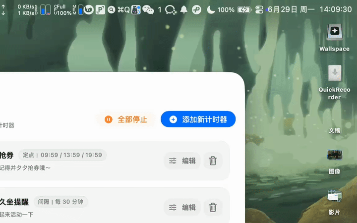
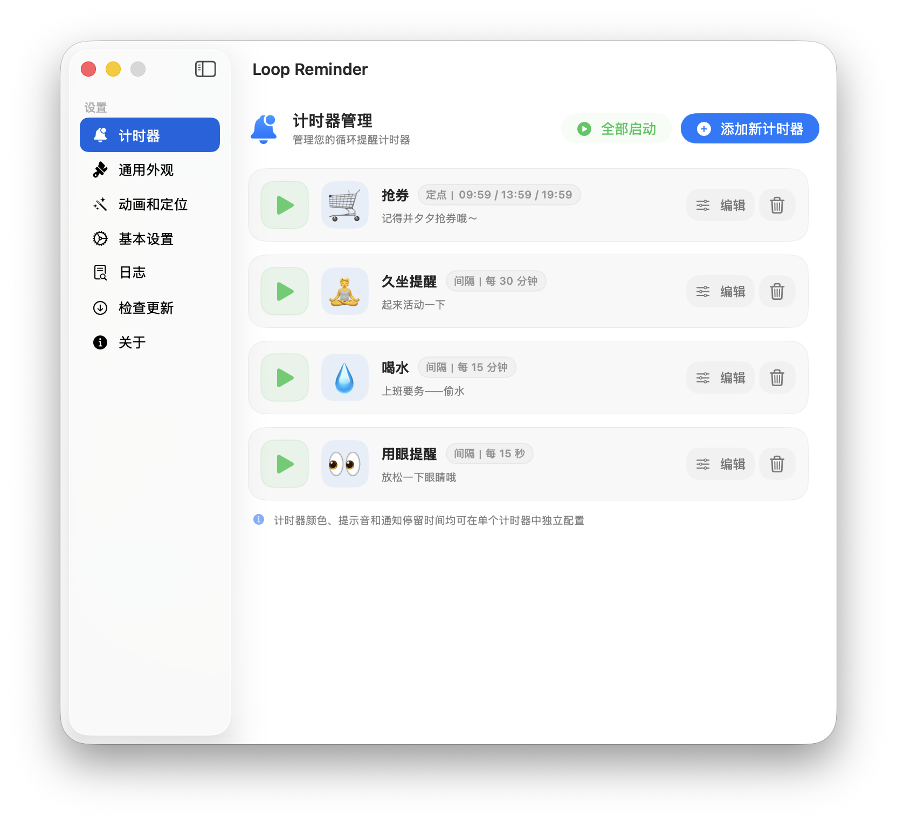
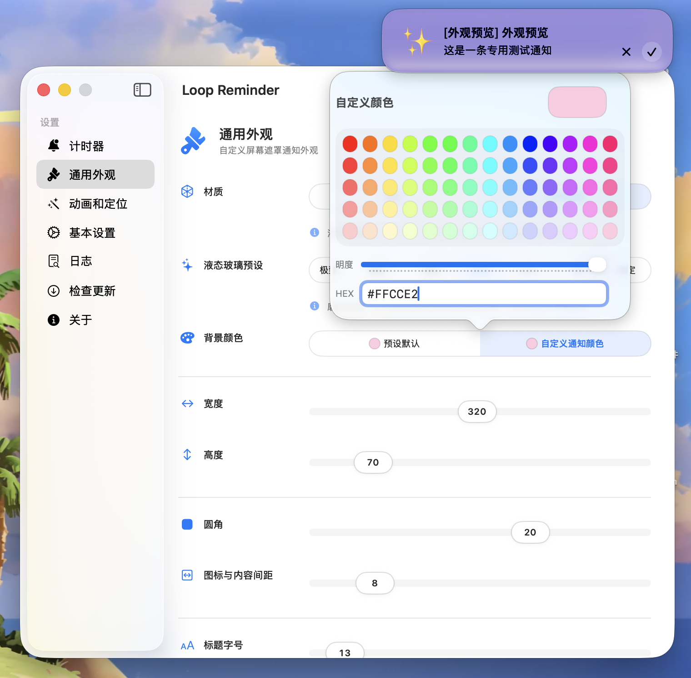
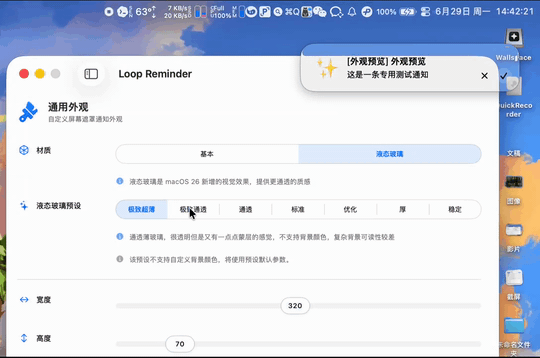
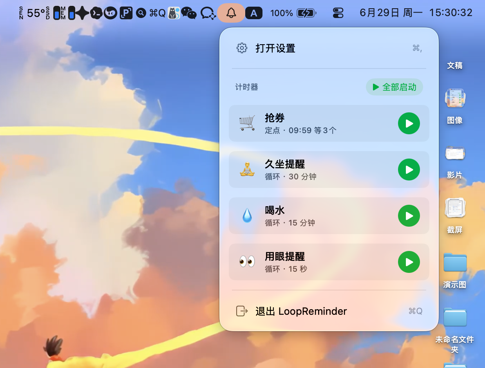

<h1 align="center">
   
  
   
  Loop Reminder
   
</h1>

<h4 align="center">一款简洁优雅的 macOS 循环提醒工具，帮助你保持健康的工作习惯。</h4>

  <a href="README.md">中文</a> | <a href="README.en.md">English</a>

  

## 下载

- **快上车！ ➡️**：**[Releases](https://github.com/PeixinLu/MacOS-LoopRemider/releases)**

## 特性总览

  

#### 1. 灵活提醒

支持间隔提醒或者定点提醒

  

#### 2. 超高度自定义

提供丰富的外观参数定制

  

#### 3. 丰富的液态玻璃效果

macOS26下提供丰富的液态玻璃外观预设，无论是极致透明还是针对复杂背景下文本可读性特别优化的预设，总有一款满足你

  

#### 4. 轻量高效

常驻菜单栏，低资源占用

## 🎯 使用

1. [下载最新版本](https://github.com/PeixinLu/MacOS-LoopRemider/releases)后运行

2. 点击菜单栏"铃铛"图标打开设置

   

3. 配置提醒内容、频率和外观、动画效果等

   

4. 点击"启动"开启计时器

## 🔧 系统要求

- macOS 14.0+(目前暂时仅在macOS26下经过测试)
- 液态玻璃效果仅支持macOS26
- 如果需要更多版本支持，请[告诉我](https://github.com/PeixinLu/MacOS-LoopRemider/issues/new)

## 📝 开发

- 基于 SwiftUI构建。
- 基本网络请求用于检查版本更新

## 🙏 致谢

感谢以下开源项目的支持：

- [LaunchAtLogin-Modern](https://github.com/sindresorhus/LaunchAtLogin-Modern) - 优雅的开机启动管理库
- [Sparkle](https://github.com/sparkle-project/Sparkle) - macOS 应用自动更新框架
